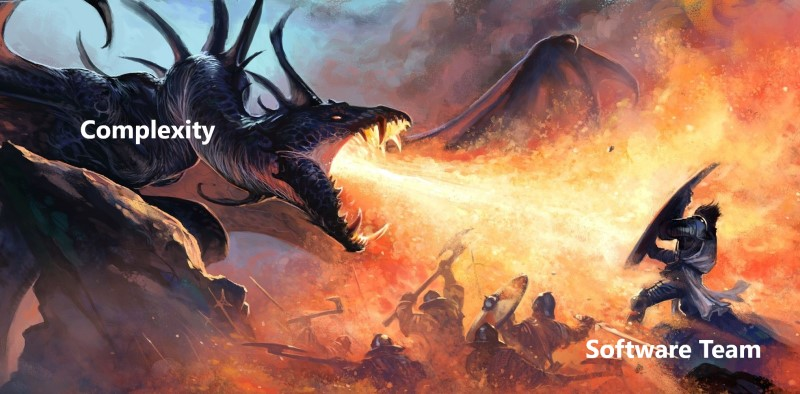
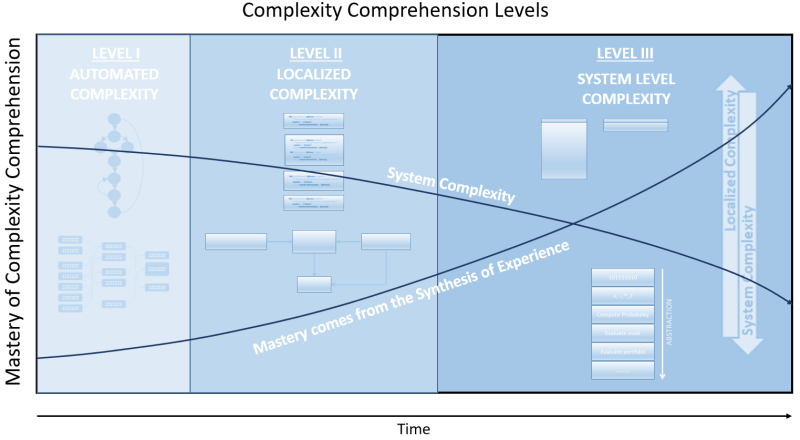

# Complexity is Evil Incarnate

Join the band of noble warriors that vow to rid the land of this wretched beast
that plagues our repositories, terrorizes our backlogs, and devours the fruits
of our labor. Complexity's reign of terror must end! But be warned, only the
true of heart can hope to survive an encounter with this most despicable of
creatures. The bones of many a noble programmer lie strewn about the brute's
lair. Scorching fire, razor-sharp teeth, and crushing death await ye. Yet for
those courageous enough to face the trials, glory, honor, and immortality await!

Wait, wait, wait... Before you go rushing off to embrace your eminent demise,
allow me to equip you with the required armaments. Knowledge, that is the only
weapon that can save you from your peril. You must have a profound understanding
of the Complexity dragon if you hope to slay it.

Now that I have you attention, let's get serious...

## The Case for Simplicity
Pretty much every software engineering luminary espouses simplicity:

- [Software design is] a craft… and it has a lot to do with valuing simplicity
    over complexity — Barbara Liskov
- We need to build simple systems, if we want to build good systems — Rich
    Hickey 
- The only way to write complex software that won’t fall on its face is
    to hold its global complexity down, to build it out of simple parts — Eric
    S.  Raymond
- Simplicity is a prerequisite for reliability.— Edsger Dijkstra 
- The price of reliability is the pursuit of the utmost simplicity— Tony Hoare
- Considered next to testing and reasoning, simplicity is more important than
    either. An investment in simplicity, is often the better choice because it
    will facilitate all future attempts to understand the system — attempts of
    any kind. - Ben Moseley and Peter Marks

> ### Axiom #1 of software engineering:
>
> Every programmer's primary goal should be to create the simplest possible
> software which solves the problem.

Unfortunately, this axiom is well known yet seldom fully understood. The goal of
this piece is to cultivate complexity acumen.

> ### Discussion Questions:
>
> Do you feel that you have in-depth knowledge about software complexity and how
> to manage it?
>
> Where did you learn about software complexity?

## What is Complexity
High Level Definition of Complexity:
> Complexity is anything related to the structure of a software system that
> makes it hard to understand and modify - *A Philosophy of Software Design* by
> John Ousterhout 

Two papers about complexity that every software professional should read:
- No Silver Bullet, Fred Brooks, 1986
- Out of the Tar Pit, Ben Moseley and Peter Marks, 2006

Two Types of Complexity:
- *Essential Complexity* - is inherit in, and the essence of, the problem (as
    seen by the user)
- *Accidental Complexity* - Complexity with which the development team would not
    have to deal in the ideal world (complexity arising from performance issues
    and from suboptimal language and infrastructure)
    
> ### Key Concept:
>
> From here forward, assume *complexity* refers to *accidental complexity*

> ### Quiz 1
> Classify each source of complexity as either essential or accidental:
> 1. Design patterns
> 1. Regulatory Laws
> 1. Requirements
> 1. Friction between software tools (e.g. Karma and IntelliJ)
>
> Is it possible to completely eliminate accidental complexity?
> - Yes
> - No
>
> [Answers](Quiz-1.md)

## Levels of Complexity Competency
Like any competency, understanding software complexity isn't binary. There are
levels of understanding (think Bloom Taxonomy). Your ability to combat
complexity is limited by your competency.

1. Automated Complexity Measures
1. Localized Complexity
1. System Complexity

## Automated Complexity Measures
There are amazing algorithms that are capable of identifying complexity via
static code analysis. This is the easiest type of complexity to mitigate.

Cyclomatic Complexity 
- First introduced in 1976 by Thomas J. McCabe in seminal paper *A Complexity
    Measure*
- Code is modeled as a graph where a Node = computation and an Edge = transfer
    of control
    * 
        (Complexity = (number of edges) - (number of nodes) + 2)
- The most common accepted limit is 10, but it's just a guideline
    * For those fascinated by Psychology, look up *The Magic Number 7, Plus or
        Minus Two* for some insight into that number
- Many attempts to improve:
    * LCOM4
    * NPath
    * Coupling Ratio - ratio between efferent & total coupling
    * etc...

Measuring software complexity is an ongoing academic pursuit (some would even
call it a holy grail). The subject is WAY to deep to give it justice here.

Most controversial of all complexity reduction techniques. However, its' the
**ONLY** technique that is backed by actual empirical data.
- 1989 - Software Defect Prevention Using McCabe's Complexity Metric by William
    T. Ward found "64% statistical correlation between cyclomatic complexity and
    defect density"

Automated Complexity measures are easy and IMPORTANT. Ignore them at your own
peril. They encourage things like (non-exhaustive):
- Simple logic
- Small functions
- Modular design

Automated measure are not perfect. There are some shortcomings because they:
- Overly focused on Algorithmic Complexity
- Can not access how easy software is for a human to understand.

our intellectual powers are rather geared to master static relations and that
our powers to visualize processes evolving in time are relatively poorly
developed. For that reason we should do (as wise programmers aware of our
limitations) our utmost to shorten the conceptual gap between the static program
and the dynamic process, to make the correspondence between the program (spread
out in text space) and the process (spread out in time) as trivial as possible.

Keep data together is easy to understand
On the down side, in spite of the many advantages, automated measures can never
truly access how easy software is for a human to understand. Algorithmic
complexity doesn't access even simple things such as meaningful variable names.
Additionally, 
Therefore, it's never a good idea to impose oppressive controls based on
automated complexity measures.

> Key Concept:
>
> It is possible to game automated complexity measurements. Additionally, lower
> complexity measures don't necessarily equate to lower perceived complexity.
> However, they are an excellent "canary" metric.

---

One of the tragedies of software engineering is that, in industry at least,
we've successfully avoided the metrics-based quality revolution that transformed
manufacturing. 

When measuring complexity, it is important to look holistically at coupling,
cohesion, SQL complexity, use of frameworks, and algorithmic complexity.

## Naive Complexity

With software complexity, there are generally two levels of comprehension.
- Naive
    * Think Georg Cantor's Naive Set Theory
    * Immensely important
- Advanced
    * 

---
## Empirical Evidence

For nearly all of history, people’s lives have been governed primarily by
ignorance. … Failures of ignorance we can forgive. If the knowledge of the best
thing to do in a given situation does not exist, we are happy to have people
simply make their best effort. But if the knowledge exists and is not applied
correctly, it is difficult not to be infuriated. … It is not for nothing that
philosophers gave these failures so unmerciful a name—ineptitude.

Is software development really hard, or are software developers not that good at
it? Certainly there are parts of software that are hard, but software developers
seem to do everything in their power to make even the easy parts harder by
wasting an inordinate amount of time on reinvention and inefficient approaches.

Much of what has been espoused in software engineering in the last twenty
years—Agile development, unit testing, the debate about errors versus
exceptions, and the benefits of different programming languages—has been
presented without any experimental backing.

Sturgeon’s law, coined by the science fiction writer Theodore Sturgeon, which
posits that “90% of everything is crap.”

“Researchers solve problems that are solvable, not necessarily ones that are
real.”

If you’re like me, you dream of a day when software engineering is studied in a
thoughtful, methodical way, and the guidance given to programmers sits atop a
foundation of experimental results rather than the shifting sands of individual
experience.
*The Problem With Software: Why Smart Engineers Write Bad Code*, Adam Barr

Today we have faster hardware, more expressive programming languages, and better
debugging tools. But if you read the old books, it is clear that the fundamental
issues have not changed.

Internet theory, “If you want somebody to explain something to you, then give a
wrong explanation in public.”

 insight from Socrates: “The good craftsmen seemed to have the same fault as the
 poets: each of them, because of his success at his craft, thought himself very
 wise in other most important pursuits, and this error of theirs overshadows the
 wisdom they had.”

Software engineering is gravely hampered today by immature practices. Specific
problems include: – The prevalence of fads more typical of a fashion industry
than of an engineering discipline – The lack of a sound, widely accepted
theoretical basis – The huge number of methods and method variants, with
differences little understood and artificially magnified – The lack of credible
experimental evaluation and validation – The split between industry practice and
academic research54

*A Philosophy of Software Design*, John Ousterhout

---

An important distinction is that *system complexity* is a different concept than
*localized complexity*. Software is composed of many individual parts (modules,
classes, etc...).
- *Localized Complexity* - complexity as viewed from within an individual part
    of the system (this is where more developers concentrate their time)
- *System Complexity* - the sum of the complexity created by the way individual
    parts interact within the system weighted by the amount of time developers
    spend managing the interactions.

More formally, *System Complexity* is defined as:
> The overall system complexity ()
> is determined by the complexity of each part
> () weighted by the
> fraction of time developers spend working on that part
> ()
>
> 

Localized complexity is no doubt unfavorable. However, system complexity is
cataclysmic.

It is often possible to lower system complexity by raising localized complexity.
(more on this later)

## Simplicity Nuances

Simplicity is difficult to demonstrate
- There is no simplicity checklist
- Techniques used to simplify a large system often over-complicate a small one;
    therefore, examples are difficult.
    * Examples small enough to comprehend in a tutorial aren't complex enough to
        demonstrate salient concepts
    * Typically leads to rampant over-engineering

 Simplicity 

## Three Symptoms of Complexity

1. Change amplification - A simple change requires many code modifications
1. Cognitive load - How much a developer needs to know in order to complete a
   task.
   - APIs with many methods, global variables, inconsistencies, dependencies
       between modules
   - Sometimes an approach that requires more lines of code is simpler because
       it reduces cognitive load
1. Unknown unknowns: it is not obvious which pieces of code must be modified to
   complete a task, or what information a developer must have to carry out a
   task
   - These are by far the worst
   - The best way to reduce complexity is to make code *obvious*

 ## What Causes Complexity

 1. Dependencies
    - One of the goals of software design is to reduce the number of
        dependencies and make the necessary ones as obvious as possible.
 1. Obscurity
    - Important information is not obvious
    - Inconsistency often contributes to obscurity
    - The need for extensive documentation is a sign that your design is too
        obscure

Complexity is never caused by a single catastrophic oversight. It accumulates
slowly like filth in a floor crack. The path to simplicity is one of determined
vigilance.

Design Patterns
- Caution: "He who fights too long against dragons becomes a dragon himself; and
    if you gaze too long into the abyss, the abyss will gaze into you"

---
"Debugging is twice as hard as writing the code in the first place. Therefore,
if you write the code as cleverly as possible, you are, by definition, not smart
enough to debug it." - Brian Kernighan

No Silver Bullet — Essence and Accidents of Software Engineering - Fred Brooks

> Much of the complexity that [a programmer] must master is arbitrary
> complexity, forced without rhyme or reason by the many human institutions and
> systems to which his interfaces must conform. 

Fred Brooks

The goal is to remove accidental complexity via smart architecture and choice of
tools

Complex code is different than complicated code
- Complex - has a measurable level of complexity (cyclomatic complexity, etc...)
- Complicated - Psychological Complexity - Is the code hard to understand
    * Completely subjective
- Familiarity does not equate to simplicity 
- Complicated code becomes uncomplicated via research
- Complex code will always be complex until it's re-written
- Making complicated code less complex will not necessarily make it less
    complicated.

The math behind software complexity is just a measure to quantify. It is not
necessary to understand it to reduce complexity.

## Simplicity is Hard
> Simplicity is the most intensely intellectual of the XP values. To make a
system simple enough to gracefully solve only today's problem is hard work. -
Kent Beck

> I didn't have time to write a short letter, so I wrote a long one instead -
attributed to many different great thinkers

> e n’ai fait celle-ci plus longue que parce que je n’ai pas eu le loisir de la
faire plus courte. - Pascal

Agile Doctor "high quality costs three times as much up front but is 40% cheaper
in the long run"
- Find this chart

No control over software you must consume (3rd party libs, legacy, etc...)
    * The software "we" write makes up a surprisingly small portion of the
        system

## Principals

Blindly following rules leads to complexity
- DRY
- SOLID
- Composition over inheritance

Simplicity is somewhat subjective
    - Justice Potter's definition of pornography: "I know it when I see it"

- The fewer the parts, the simpler the program
- Separating from general to specific is simplifying
- Simplicity is tantamount to brevity

I conclude that there are two ways of constructing a software design: One way is
to make it so simple that there are obviously no deficiencies and the other way
is to make it so complicated that there are no obvious deficiencies.— Tony Hoare

[Software simplicity] demands the same skill, devotion, insight, and even
inspiration as the discovery of the simple physical laws which underlie the
complex phenomena of nature. It also requires a willingness to accept objectives
which are limited by physical, logical, and technological constraints, and to
accept a compromise when conflicting objectives cannot be met. — Tony Hoare

# Why Complex?

- There is no single development, in either technology or in management
    technique, that by itself promises even one order-of-magnitude improvement
    in [software] productivity, in reliability, in simplicity. — Fred Brooks

- The one thing you can be sure of is when you get any number of people
    together, they will disagree. Topics of disagreement include the problem,
    the solution, and the implementation of the solution.
    - Framing in this way is silly. The are multiple dynamic problems as seen by
        different people in the system.

- Any meaningful program will become complex over time

- It's impossible for simplicity to spring from simple thinking
    - No magic bullets

- A programming language is low level when its programs require attention to the
    irrelevant. — Alan Perlis

One of the main intentions of React is to abstract away the DOM. However, React
provides refs for those cases where you may need to interact with the DOM. To do
so, of course, you must understand how to interact with the DOM. This means that
the abstraction has failed. In fact, it introduces the additional complexity of
having to understand how to “escape” React to interact with the DOM.

The latest and greatest introduces chaos
- Dale's law of software entropy - if you have a ball of mud, it's not the
    fault of the tools, it's the fault of the team
- Programmers are not to be measured by their ingenuity and their logic but
    by the completeness of their case analysis. — Alan Perlis

if the core value you deliver is technology, it is rarely a good idea to adopt
tools that your best developers don’t want to work with.

our industry right now is far too worried with following the lead of the big
tech giants to realize that sometimes their tools don’t add a lot of value to
our projects.

A lot of developers right now seem to be so obsessed with the technical wizardry
of it all that they can’t step back and ask themselves if any of this is really
needed.

Our answer to the growing complexity of doing business cannot be adding
complexity to the development process – no matter how elegant it may seem.

We must find ways to manage complexity by simplifying the development process.
Because even though managing complexity is our second most important
responsibility, we must always remember the most important responsibility of
software developers: delivering value through working software.
https://www.simplethread.com/software-complexity-killing-us/

## Managing Software Complexity

Two Approaches
1. Make code simpler and more obvious
1. Encapsulate it so that programmers can work on a system without being exposed
   to all the complexity at once

For any given code you want to write, there are likely multiple way to write it,
and not a lot of wisdom about which one to choose.
- Paradox of choice by Barry Schwartz - more choices do not make us happier.

When people say, “It’s inevitable that a large program will have bugs,” they
don’t mean inevitable in the sense, “It’s inevitable that cars will have
accidents.” What they mean is, “We don’t have the proper software engineering
techniques to root out all defects so we’re not even going to attempt to remove
them all—and we’re not going to improve the techniques either.”

“Patterns make it easy to make a system more complex. They achieve flexibility
and variability by introducing levels of indirection, which can complicate a
design. It’s better to start simple and evolve a design as needed.”

1971, in The Psychology of Computer Programming, Gerald Weinberg wrote, “We
shall be hampered by our inability to measure the goodness of programs on an
absolute scale. But can we perhaps measure them on a relative scale—can we say
that program A is better or worse than program B? Unfortunately, we will
generally not even be able to do that, for several reasons. First of all, when
is there ever another program with which to compare?”20

It's a well know fact that the Dragon of Grindly Grun was actually just a
software project with complexity run awry.
<pre>
The Dragon Of Grindly Grun - Poem by Shel Silverstein

I'm the Dragon of Grindly Grun, 
I breathe fire as hot as the sun. 
When a knight comes to fight 
I just toast him on sight, 
Like a hot crispy cinnamon bun. 

When I see a fair damsel go by, 
I just sigh a fiery sigh, 
And she'd baked like a 'tater- 
I think of her later 
With a romantic tear in my eye. 

I'm the Dragon of Grindly Grun, 
But my lunches aren't very much fun, 
For I like my damsels medium rare, 
and they always come out well done. 
</pre>

## Bibliography
- A Complexity Measure, T.J. McCabe
    (https://ieeexplore.ieee.org/abstract/document/1702388)
- No Silver Bullet - Essence and Accidents of Software Engineering, Fred Brooks
    (https://ieeexplore.ieee.org/document/1663532)
- Out of the Tar Pit, Ben Moseley and Peter Marks
    (http://curtclifton.net/papers/MoseleyMarks06a.pdf)
- The Problem With Software: Why Smart Engineers Write Bad Code, Adam Barr
    (https://www.amazon.com/gp/product/B07HYM9WFM/ref=kinw_myk_ro_title)
- Clean Code, Robert C. Martin
    (https://www.amazon.com/Clean-Code-Handbook-Software-Craftsmanship/dp/0132350882/ref=sr_1_2)
- Agile Software Development, Principals, Patterns, and Practices, Robert Martin
    (https://www.amazon.com/Software-Development-Principles-Patterns-Practices/dp/0135974445/ref=sr_1_1)
- A Philosophy of Software Design, John Ousterhout
    (https://www.amazon.com/gp/product/B07N1XLQ7D/ref=kinw_myk_ro_title)
- Taming Complexity, Jack Ganssle
    (http://www.ganssle.com/articles/cyclomaticcomplexity.html)
- Software Defect Prevention Using McCabe's Complexity Metric, Hewlett-Packard
    Journal, William T. Ward
    (http://www.hpl.hp.com/hpjournal/pdfs/IssuePDFs/1989-04.pdf)
- The Magical Number Seven, Plus or Minus Two: Some Limits on Our Capacity for
    Processing Information," Psychological Review, 63 (1956), 81-97
